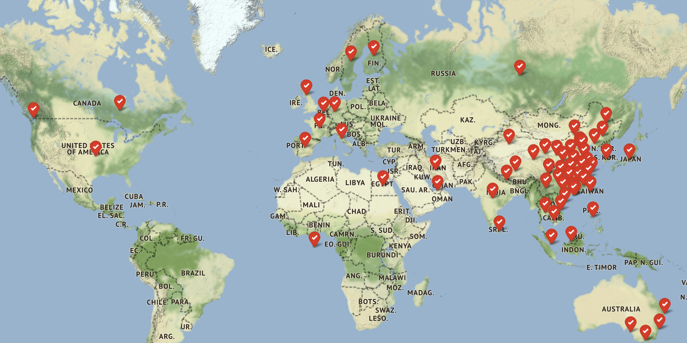
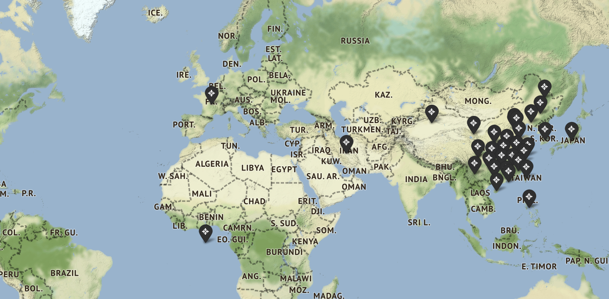
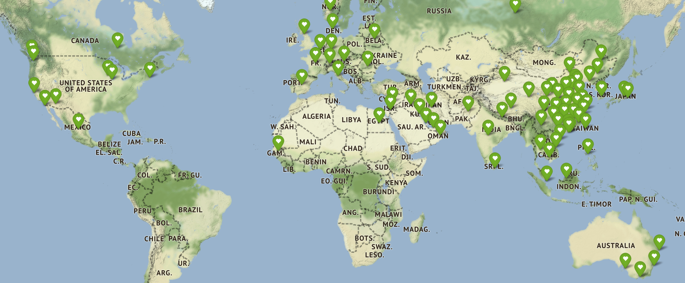
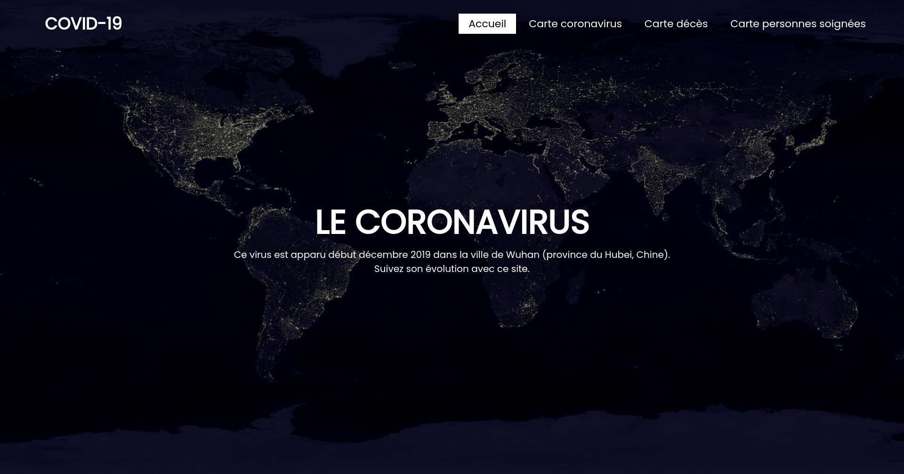

# CoronaTracker

## Context

I did this project when I was 16 in February 2020 (at this moment I thought that the situation would be less problematic). 

## What did I do ?

I used CSV files I found on this repo : https://github.com/CSSEGISandData/COVID-19 and made a script in python (coronavirus.py) to get statistics on SARS-CoV.

Then I created maps in python (folium) to represent some of these datas :

  

*Yes, the statistics were better.*

I've also made a homepage :

 
 

The project is no longer updated, first, because the algorithm is bad and it's slow ... Secondly because I'm don't want to make statistics on people's misfortune.

